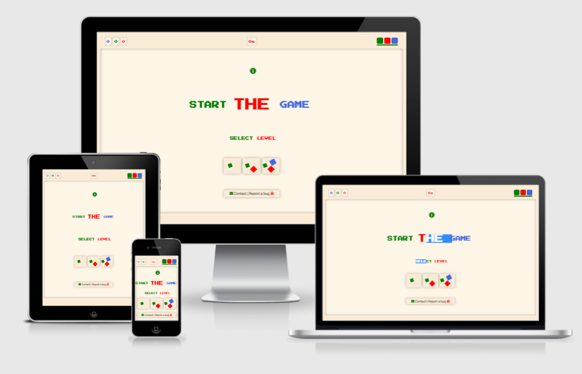
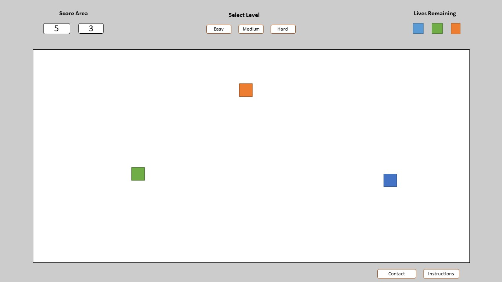
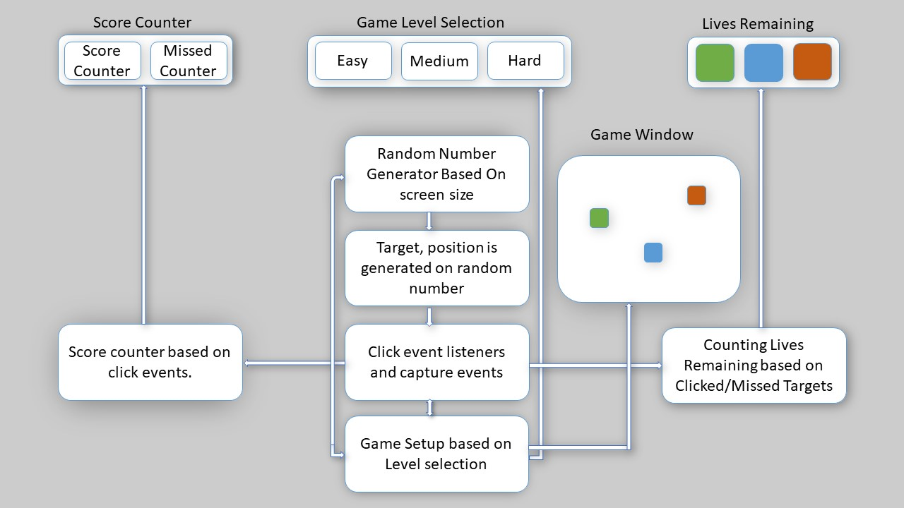
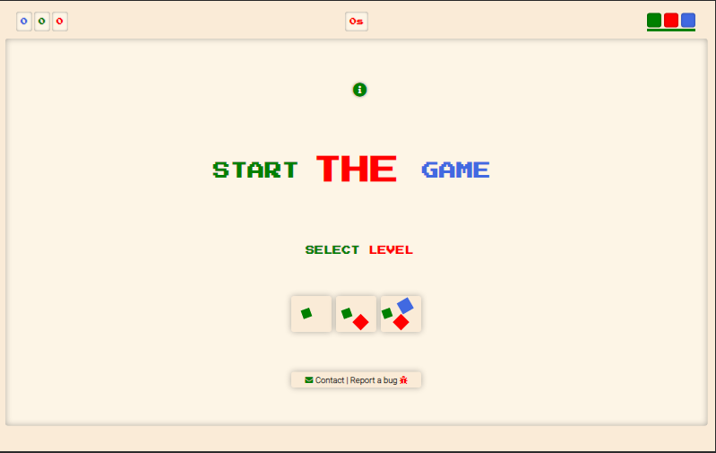
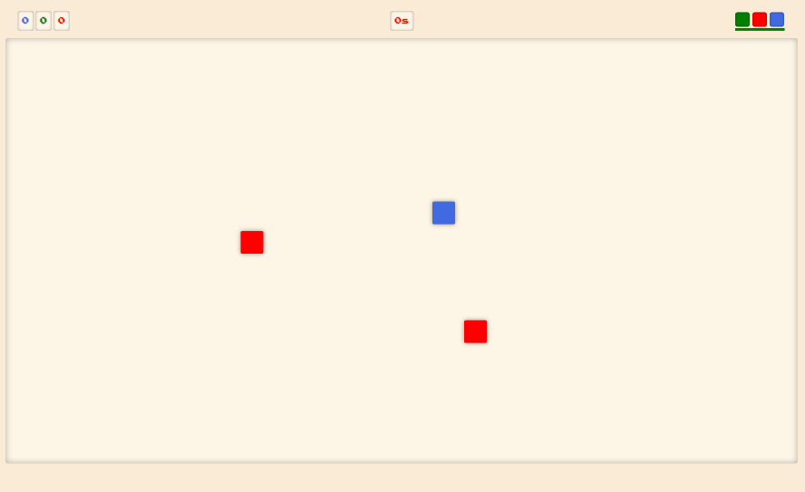
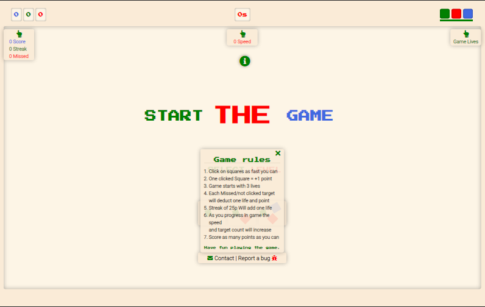
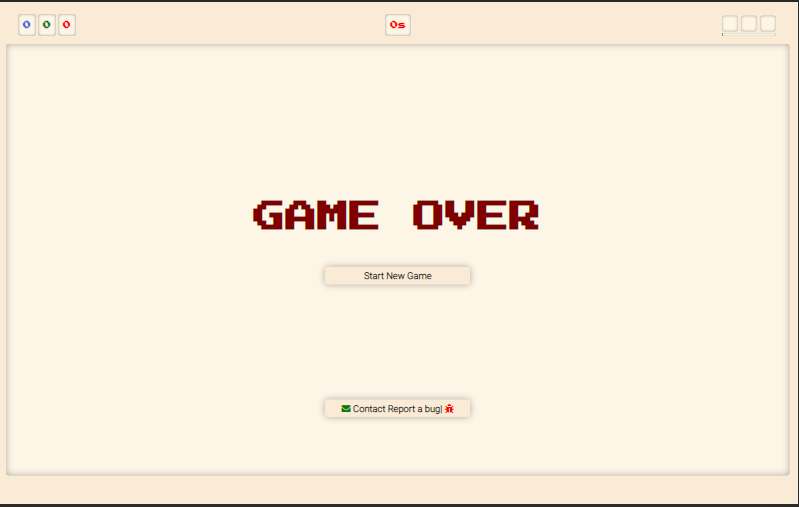
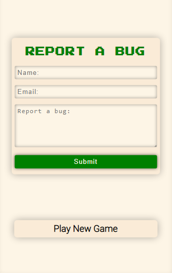
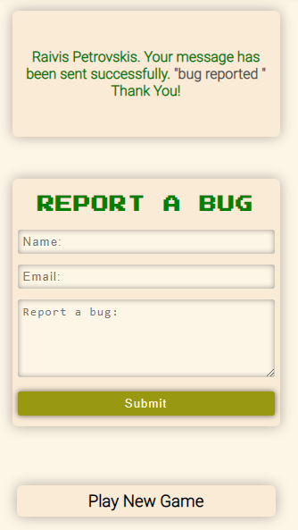

# Top

## MS-2 JavaScript | Reaction Time Game.

<!--For assestment - README.md file structure was copied from my first milestone project."-->

## [View the live project here.](https://raivis80.github.io/MS-2-JavaScript/game.html)
### Table of contents

1. [Introduction](#Introduction)
1. [UX](#UX)
    - [Player goal's](#Player-goal's)
    - [Owner's goal's](#Owner's-goal's)
    - [Developer's goal's](#Developer's-goal's)
1. [Scope](#Scope)
    - [Functionality Requirements](#Functionality-Requirements)
1. [Wireframe](#Wireframe)
1. [Game Mechanics](#Game-Mechanics)
1. [Game Logic](#Game-Logic)
1. [Design](#Design)
1. [Features](#Features)
    - [Key features](#Key-features)
1. [Testing](#Testing)
1. [Technologies and Frameworks](#Technologies-and-Frameworks)
   - [Markup/Scripting/Programming languages](#Markup/Scripting/Programming-languages)
   - [Frameworks/Libraries/Programs](#Frameworks/Libraries/Programs)  
1. [Deployment](#Deployment)
   - [Deployment on GitHub Pages](#Deploying-on-GitHub-Pages)
   - [Forking the Repository](#Forking-the-Repository)
   - [Creating a Clone](#Creating-a-Clone)
1. [Credits](#Credits)
   - [Code](#Code)
   - [Helpfull sites](#Helpfull-sites)
   - [Acknowledgements](#Acknowledgements)

# [&#8686;](#Top)
## ***Introduction***

**Single-player reaction time game** 

This is my second of four Milestone Projects that the developer must complete during Full Stack Web Development Program at The Code Institute. 

The main requirements is to write custom front-end interactive web application, using HTML, CSS and Javascript, JavaScript libraries and/or Application Programming Interfaces (APIs).

In order to manipulate the DOM as much as posible, I'm building a simple JavaScript single-player reaction time game.  
The objective of the game is to click or tap the objects that are spawning randomly on the screen as quickly as you can. 
To keep the game challenging, complexity will increase over the course of the game.
# [&#8686;](#Top)

## **UX**
### **Player goal's**
1. Have fun playing game.
1. Age appropriateness and child-friendly.
1. User friendly controls.
1. Improve reaction times
1. Information on how to use game.
1. If mobile verssion available.
1. Is desktop version available.
### **Owner's goal's**
1. Make a game that is fun to play.
1. The game is suitable for players of all ages.
1. The game Is child friendly.
1. The game works on most devices.
1. Game rules available in-game on how to use the game.
1. Bug report is important, include contact form.
### **Developer's goal's**
1. Developer Learn code in JanvScript as JavaScript is part of full stack software development course.
1. Connect at least one API.
1. Developer will manipulate the DOM as much as posible.
1. Developer will take up the challenge and learn new skills.
1. Include a JavaScrip project to build a portfolio.
# [&#8686;](#Top)
## **Scope**
### **Functionality Requirements**
1. Build a simple single-player reaction time game.
1. Three level sellection. Easy, medium and hard depending on device.
1. Increase in complexity over the course of the game.
1. Click counter if player clicks or misses the target.
1. Provide player with instructions on how to play the game.
1. Feedback form if encountered bugs or glitches.
1. Provide player with feedback on how they're doing at any stage.
# [&#8686;](#Top)
## **Wireframe**

# [&#8686;](#Top)
## **Game Mechanics**
1. Game Play
    - Select dificulty level to start the game.
    - Click or tap on target objects once they spawn.
1. Select Level 
    - Touch enabled devices staart with higher speed.
    - Levels for mobile devices  = "Easy" Start with one target, "Medium" start with two targets "Hard" start with three targets.
    - Levels for PC's devices  = "Easy" Start with two targets, "Medium" start with three targets "Hard" start with four targets.
1. Score Counters
    - Score counter:
        - Will increase by 1, once player clicks on the target.
    - Missed score counter:
        - Will increase by 1 if target is not clicked on time or target is missed altogether.
1. Lives Remaining
    - The game starts with three lives.
    - Players will gain life once every 50 score points. 
    - Maximum three lives can be gained at once.
    - Player will lose life if target is not clicked on time or target is missed altogether. 
    - Losing all lives means "game over".
# [&#8686;](#Top)
## **Game Logic**  

- Select Level
    - Added touchscreen detection, for mobile devices starting speed is faster than pointing enabled devices.
    - Levels for mobile devices  = "Easy" Start with one target, "Medium" start with two targets "Hard" start with three targets.
    - Levels for PC's devices  = "Easy" Start with two targets, "Medium" start with three targets "Hard" start with four targets.
- Lives Remaining
    - Based on capture and click events, all Unsuccessful clicks and missed on time events will disable one life element.
    - Based on Score counter, every 50 score points will create one life. Enable one life element (if statement).
    or miss click the box on time 
- Random Number generator
    - Extract Window height and width.
    - Create random number integer generator
    - Generate two integers based on screen height and width.
- In game target objects
    - Target HTML div elements in the DOM for game box targets.
    - Two random generated integers used for position x and y coardinates to target css position properties for HTML div elements.
- Click event listeners and capture events.
    - Create event listeners for game targets that will record successfull clicks and disable target once clicked.
    - Create event listener for game window to record unsuccessful clicks.
    - Capture events on all failed click attempts. I managed to acheave this by counting how many objects at the end of setInterval() cycle has display: none; 
- Game setup
    - Based on Level selection. if "EASY", else if "MEDIUM", else if "HARD".
    - Level variable will be passed into setInterval() function and will launch the game.
- Game Proggression levels
    - Speed will increase over course of the game. 
    - Target count will increase over course of the game
    - Create setInterval() function pass it into game level sellection once desired score is reached.
# [&#8686;](#Top)
## **Design**

- Color Sheme
    - Body background color antiquewhite.
    - Game Window background color oldlace.
    - Font and element background color red, royelBlue and green.
- Typography
    - Primary font-family: Press Start 2P with cursive as a fallback font
    - Secondary font-family: Roboto witn sans-serif as a fallback
# [&#8686;](#Top)
## **Features**
### **Home Page**

### **In Game**

### **Game Information Popout**

### **Game Over**

### **Contact | Bug report**

### **Key features**
- The game 
    -  The Game Detects touch devices and sets difficulty accordingly
    -  Responsive works on most devices(deskpop, mobile)
    -  It can be resized and it will recalculate the game area on the fly.
- Game Window
    -  Interactive game area, that is where target box objects spawn for user to click or tap on.
- Select Level
    - Player can select difficulty level.
    - Touch devices difficulty differ from pointing enabled devices
- Score counter 
    - Enables players to keep track of points when playing a game.
- Speed display
    -  Enables players see current game speed in secounds.
- Lives Remaining
    - If player miss box target, you lose one life but once score 50 has been reached, palyer will gain one life.
- Game-level-Up
    - Gain enough points in the game to enable a player to go up to a higher level.
    - Speed and target count is increasing over course of the game.
- Contact/Bug report form
    - For users to be able to send feedback or contact if they incounter any gliches or bugs.
- Game Help/instruction Pop-up
    - Enables Player to to looak at game instructions on how to play the game.
# [&#8686;](#Top)
## **TESTING**
The Game was tested on Chrome, Opera, Microsoft edge and Firefox desktop version browsers and on huawei p30 Pro chrome and android browser.

Chrome DevTools was used to Test variety of devices such as Desktop, Laptop, iPhone7, iPhone 8 & iPhoneX for responsive design.

Friends and family members helped point out any bugs or issues.
# [&#8686;](#Testing)
## **W3C Validation**
  The W3C Markup Validator and W3C CSS Validator Services were used to validate every page of the project to ensure there were no syntax errors in the project.

- [W3C Markup Validator](project_files/validation/Html-Checker.PNG)
- [W3C CSS Validator](project_files/validation/W3C-CSS.PNG)
# [&#8686;](#Top)
## **Technologies and Frameworks**
### **Markup/Scripting/Programming languages**
- [HTML5](https://en.wikipedia.org/wiki/HTML5) Hypertext Markup Language (HTML)
- [CSS3](https://en.wikipedia.org/wiki/Cascading_Style_Sheets) Cascading Style Sheets (CSS)
- [JavaScript](https://www.javascript.com/) Interactive functionality.

### **Frameworks/Libraries/Programs**
- [Google Fonts:](https://fonts.google.com/) Making the web more beautiful.
- [Font Awesome:](https://fontawesome.com/) to add icons to the website.
- [Git](https://git-scm.com/) Git was used for version control.
- [GitHub:](https://github.com/) used to store the projects code.
- [gitpod.io](https://gitpod.io/) gitpod Was used for codding.
- [VS Code](https://code.visualstudio.com/) gitpod Was used for codding.

# [&#8686;](#Top)
## ***Deployment***
Source: https://docs.github.com/
### **Deploying on GitHub Pages**
1. Log into [GitHub](https://github.com/login "Link to GitHub login page") or [create an account](https://github.com/join "Link to GitHub create account page").
1. Locate the [GitHub Repository](https://github.com/Raivis80/)"Link to GitHub Repo".
1. In the GitHub repository, navigate to the Settings tab.
1. From the source section drop-down menu, select the Master Branch.
1. Upon selection, the page will automatically refresh meaning that the website is now deployed.
1. Under "GitHub Pages", select the GitHub Pages visibility drop-down menu, then click a visibility.
1. Now deploy it to GitHub Pages.
1. To see your published site, under "GitHub Pages", click your site's URL.

More Detailed information on GitHub Pages can be found here: [here](https://docs.github.com/en/pages/getting-started-with-github-pages/creating-a-github-pages-site#creating-your-site) "Link to GitHub docs"
### **Fork A repository**
A Fork is a coppy of repository allows you to freely experiment with changes without effecting the original project.
 Forking a repository is a simple two-step process.

1. On GitHub, navigate to The [GitHub Repository](https://github.com/Raivis80/)" Link to my Repo".
1. In the top-right corner of the page, click Fork.

Detailed Steps for forkig a repository from GitHub can be found here: [here](https://docs.github.com/en/get-started/quickstart/fork-a-repo)
### **Creating a Clone**

You can clone reposetory. When you clone repository, you copy repository to your Machine.
 Locate the [GitHub Repository](https://github.com/Raivis80/)"Link to GitHub Repo".
 Steps for cloning a repository from GitHub can be found here: [here](https://docs.github.com/en/free-pro-team@latest/github/creating-cloning-and-archiving-repositories/cloning-a-repository) "Link to GitHub docs"
# [&#8686;](#Top)
## ***Credits***
### **Code**

- Some of emailjs API code is reused of Code Institute Resume project. Thanks to Matt Rudge.
- Detect touchscreen devices [link here](https://hacks.mozilla.org/2013/04/detecting-touch-its-the-why-not-the-how/)
- Prevent click event trigger on child elements helped me to solve this Stackoverflow user abaz [link here](https://stackoverflow.com/questions/1369035/how-do-i-prevent-a-parents-onclick-event-from-firing-when-a-child-anchor-is-cli)                     

### **Helpfull sites**
#### **Thanks To:**
-  [google.com](https://google.com/): Search for anything.
-  [stackoverflow.com](https://stackoverflow.com/): Useful website for code tips.
-  [www.w3schools](https://www.w3schools.com/): Examples of how to use HTML, CSS, JavaScript.
-  [developer.mozilla.org](https://developer.mozilla.org/): Examples of how to use HTML, CSS, JavaScript.
-  [css-tricks.com](https://css-tricks.com/): Useful CSS styling tips.
-  [developer.mozilla.org](https://developer.mozilla.org/):Used to source how to use JavaScript.
### **Acknowledgements**
- A huge thanks to Owonikoko Oluwaseun, My Mentor for continuous support and inspire me to push myself beyond where I think I can go.
- Tutor support at Code Institute for their support.

# [&#8686;](#Top)